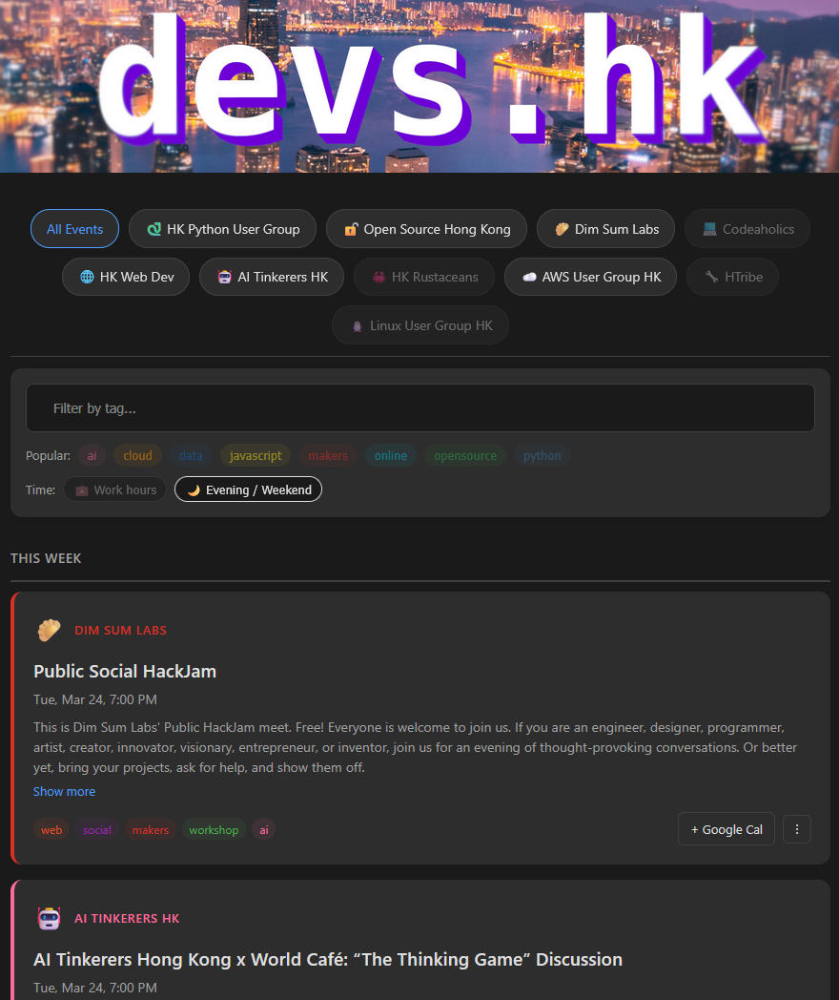

# Hong Kong IT Events
This README has 3 parts:
1. Python Program for searching HK events 
1. WhatsApp Community for sharing IT events that are **in-person** & held **during non-work hours** (event sharing only, no chitchat)
1. HK IT Community List

### Presentation
This project is part of the Presentation at [**Open Source Hong Kong**](https://opensource.hk/oshk-meetup-90-queues-for-kafka/).   
Check out the presentation slide to see the motivation for this project:
[Presentation at Open Source Hong Kong 20251113.pdf](Presentation%20at%20Open%20Source%20Hong%20Kong%2020251113.pdf)


# 1. python_hk_event_search program
**python_hk_event_search** allows you to search for Hong Kong events from various event platforms with a single command. It filters out events that occur during working hours and the topics you are not interested in, saving you time and effort.
### Features
- Fetch events from Eventbrite, Luma, Meetup, GDG HK, HKU, CityU, PolyU, and HKBU.
- Filter for events during non-working hours, in person, free, not sold out, and the categories you are interested in.
- Filter out events by keywords in their titles by modifying `title_filter_config` in the `main.py`.
- Easy to use and extend.


### Running

UV is recommended to initialize the Python environment (in case you prefer Conda: [run_with_conda.md](readme_files/run_with_conda.md)):
```bash
uv sync
uv run python main.py
```

The print result will look like this (you can further filter titles by keywords such as "AI"): 
```
=============== Eventbrite ===============
Title: WTMHK x 香港 AI 培訓學院 IWD 2026 工作坊：打破數碼營銷單線枷鎖：AI多軌製作宣傳影片
Start Date: 2026-03-13 19:30:00, Friday
End Date  : 2026-03-13 21:30:00, Friday
URL: 21 Sheung Yuet Road, Kowloon Bay, KOW
URL: https://www.eventbrite.hk/e/wtmhk-x-ai-iwd-2026-ai-tickets-1982757804969

=============== GDG HK ===============
Title: GDGHK - Build with AI Hong Kong 2026 Speaker Session #3
Type: Speaker Session / Tech Talk
Start: 2026-03-18 19:30:00, Wednesday
URL: https://gdg.community.dev/events/details/google-gdg-hong-kong-presents-gdghk-build-with-ai-hong-kong-2026-speaker-session-3/
Description: 我哋誠意邀請你參加我哋GDGHK - Build with AI Hong Kong 2026 Speaker Session #3！我們會邀請行業專家黎分享最新Google AI 發展，加上實作示範，希望令大家了解更多生成式AI發展！我地...

=============== PolyU ===============
Title: International Summit on the Use of AI in Learning and Teaching Languages and Other Subjects & Post-Summit Workshop Series
Start Date: 2025-07-04 08:00:00, Friday
End Date  : 2025-07-07 18:30:00, Monday
URL: https://www.polyu.edu.hk/en/events/2025/7/0704to0707_international-summit-on-the-use-of-ai-in-learning-and-teaching-languages-and-other

=============== HKU ===============
Title: Law in the Digital Age: The EU’s Approach to Regulating AI and Online Platforms
Date: 31 Mar - 31 Mar 2026 (Tuesday)
Time: 18:30-19:30
Venue: Academic Conference Room, 11/F Cheng Yu Tung Tower, The University of Hong Kong
URL: http://hkuems1.hku.hk/hkuems/ec_hdetail.aspx?guest=Y&UEID=105222
```

# 2. WhatsApp Community for Sharing IT Events
At the Open Source Hong Kong presentation, I concluded by highlighting a key limitation of AI: _AI cannot generate truly new ideas or innovations. AI only produces data based on patterns it has learned, which is why communities like ours are essential for sparking creativity and fresh perspectives._  
  
To further support the local IT community, I created a WhatsApp Community dedicated to **sharing after-work tech events in Hong Kong. If you enjoy tech meetups and knowledge sharing, feel free to join** (we now have over 66 members!):
    

Our community member [Iulian Arcus](https://www.linkedin.com/in/iulian-arcus/) has developed a cool website that aggregates tech events in Hong Kong. You're welcome to check it out here:  
[devs.hk](https://devs.hk/)  
  

# 3. HK IT Community List

A quick reference to active IT communities in Hong Kong — find the one that fits your interests!

| Community | Category | Links |
|-----------|----------|-------|
| **Open Source Hong Kong (OSHK)** | Code | [Website](https://opensource.hk/) · [Meetup](https://www.meetup.com/opensourcehk/) · [LinkedIn](https://www.linkedin.com/company/opensourcehk/) |
| **HK Python User Group (HKPUG)** | Code | [Website](https://pycon.hk/) · [Meetup](https://www.meetup.com/hong-kong-python-user-group/) |
| **Codeaholics** | Code | [Meetup](https://www.meetup.com/codeaholics/) |
| **AWS User Group HK** | Cloud | [Meetup](https://www.meetup.com/aws-user-group-hong-kong-meetup/) |
| **Google Developer Group HK (GDG HK)** | Cloud | [Website](https://gdg.community.dev/gdg-hong-kong/) · [Meetup](https://www.meetup.com/gdg-hong-kong/) · [LinkedIn](https://www.linkedin.com/company/gdg-hong-kong/) |
| **AI Tinkerers HK** | AI | [Website](https://hong-kong.aitinkerers.org/) |
| **AI Hong Kong (AIHK)** | AI | [Website](https://www.aihongkong.org/) · [LinkedIn](https://www.linkedin.com/company/aihongkong/) |
| **HK Machine Learning** | AI | [Meetup](https://www.meetup.com/hong-kong-machine-learning-meetup/) |
| **Data Science & GenAI HK** | AI | [Meetup](https://www.meetup.com/data-science-andgenai-hk/) |
| **vLLM Hong Kong** | AI | [Meetup](https://www.meetup.com/vllm-hong-kong-meetup-group/) |
| **PyData Hong Kong** | Data | [Meetup](https://www.meetup.com/pydata-hong-kong/) |
| **HK Web Dev** | Web | [Meetup](https://www.meetup.com/hk-web-dev/) |
| **HK WordPress** | Web | [Meetup](https://www.meetup.com/hong-kong-wordpress-meetup/) |
| **Linux User Group HK** | Linux | [Meetup](https://www.meetup.com/hong-kong-linux-user-group/) |
| **ProductTank HK** | Product | [Meetup](https://www.meetup.com/producttank-hong-kong/) |
| **Friends of Figma HK** | Design | [Website](https://friends.figma.com/hong-kong/) · [LinkedIn](https://www.linkedin.com/company/fof-hong-kong/) |
| **HK Kafka** | Kafka  | [Meetup](https://www.meetup.com/hongkong-kafka/) |
| **LLVM Social HK** | Compiler | [Meetup](https://www.meetup.com/llvm-social-hong-kong/) |
| **Dim Sum Labs** | Hardware | [Meetup](https://www.meetup.com/dimsUmlabs/) |
| **香港 Maker** | Hardware | [Facebook](https://www.facebook.com/groups/1467655926864317/) |
| **HTribe** | Hardware | [Luma](https://lu.ma/htribe) |


> Know a community that should be on this list? Feel free to open a PR or issue!

## Contributing
Feel free to share, star, fork the project, and submit pull requests (e.g., to add more event platforms or update APIs).   
For any questions or suggestions, please open an issue or start a **[GitHub Discussions](https://github.com/codeHui/python_hk_event_search/discussions)**.
